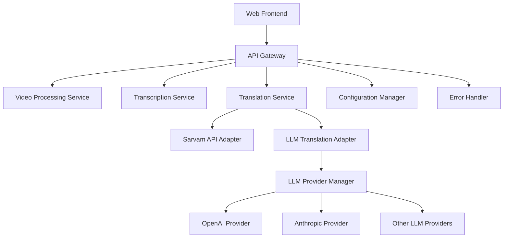

# LLM Translation Feature Design Document

## Overview

The LLM Translation feature extends the VideoSpeak system by integrating Large Language Model capabilities as an alternative translation method to the existing Sarvam API. This design outlines the architecture, components, interfaces, and implementation strategy for adding LLM-based translation while maintaining compatibility with the existing system.

The feature will provide users with the option to choose between Sarvam API and LLM for translation, with appropriate fallback mechanisms, quality metrics, and optimizations for cost and performance.

## Architecture

The LLM Translation feature will be integrated into the existing VideoSpeak architecture with minimal changes to the core system. The following diagram illustrates the updated architecture:



### Core Components

1. **Translation Service**: The existing service will be enhanced to support multiple translation methods
2. **LLM Translation Adapter**: New component that handles LLM-specific translation logic
3. **LLM Provider Manager**: Manages connections to different LLM providers
4. **Provider-specific Adapters**: Implementations for each supported LLM provider (OpenAI, Anthropic, etc.)
5. **Configuration Manager**: Enhanced to support LLM provider configuration

## Components and Interfaces

### Enhanced Translation Service

The existing `TranslationService` will be modified to support multiple translation methods:

```typescript
interface ITranslationService {
  translateText(
    text: string,
    targetLanguage: string,
    sourceLanguage?: string,
    options?: TranslationOptions
  ): Promise<TranslationResult>;
  
  getSupportedLanguages(): Language[];
  
  validateApiKey(): Promise<boolean>;
  
  isLowAccuracy(translationResult: TranslationResult): boolean;
  
  getLowAccuracyWarning(translationResult: TranslationResult): string;
}

interface TranslationOptions {
  translationMethod: 'sarvam' | 'llm';
  llmProvider?: string;
  llmModel?: string;
  maxTokens?: number;
  temperature?: number;
  contextPrompt?: string;
}
```

### LLM Translation Adapter

A new adapter will be created to handle LLM-specific translation logic:

```typescript
interface ILLMTranslationAdapter {
  translateText(
    text: string,
    targetLanguage: string,
    sourceLanguage: string,
    options?: LLMTranslationOptions
  ): Promise<TranslationResult>;
  
  getSupportedLanguages(): Language[];
  
  calculateQualityMetrics(
    sourceText: string,
    translatedText: string,
    sourceLanguage: string,
    targetLanguage: string
  ): Promise<TranslationQualityMetrics>;
}

interface LLMTranslationOptions {
  provider: string;
  model: string;
  maxTokens?: number;
  temperature?: number;
  contextPrompt?: string;
  domainHint?: string;
}
```

### LLM Provider Manager

A new component to manage different LLM providers:

```typescript
interface ILLMProviderManager {
  getProvider(providerName: string): ILLMProvider;
  
  listAvailableProviders(): string[];
  
  validateProviderConfig(providerName: string): Promise<boolean>;
}

interface ILLMProvider {
  translateText(
    text: string,
    targetLanguage: string,
    sourceLanguage: string,
    options?: LLMProviderOptions
  ): Promise<LLMProviderResponse>;
  
  getSupportedModels(): string[];
  
  getSupportedLanguages(): Language[];
  
  validateApiKey(): Promise<boolean>;
  
  getTokenUsage(text: string, model: string): number;
  
  estimateCost(tokenCount: number, model: string): number;
}

interface LLMProviderOptions {
  model: string;
  maxTokens?: number;
  temperature?: number;
  systemPrompt?: string;
  userPrompt?: string;
}

interface LLMProviderResponse {
  translatedText: string;
  sourceLanguage: string;
  targetLanguage: string;
  tokenUsage: {
    prompt: number;
    completion: number;
    total: number;
  };
  modelUsed: string;
  confidenceScore?: number;
  metadata?: Record<string, any>;
}
```

### Frontend Components

#### Enhanced LanguageSelector

```typescript
interface LanguageSelectorProps {
  onLanguageSelect: (langCode: string) => void;
  availableLanguages: Language[];
  onTranslationMethodSelect: (method: 'sarvam' | 'llm') => void;
  selectedTranslationMethod: 'sarvam' | 'llm';
}
```

#### LLM Configuration Component

```typescript
interface LLMConfigProps {
  onProviderSelect: (provider: string) => void;
  onModelSelect: (model: string) => void;
  availableProviders: string[];
  availableModels: string[];
  selectedProvider: string;
  selectedModel: string;
}
```

## Data Models

### Enhanced Translation Models

```typescript
// Extend existing TranslationResult
interface TranslationResult {
  translatedText: string;
  sourceLanguageCode: string;
  targetLanguageCode: string;
  requestId: string;
  translationAccuracy: number;
  confidenceScore: number;
  qualityMetrics: TranslationQualityMetrics;
  translationMethod: 'sarvam' | 'llm';
  llmMetadata?: LLMTranslationMetadata;
}

interface LLMTranslationMetadata {
  provider: string;
  model: string;
  tokenUsage: {
    prompt: number;
    completion: number;
    total: number;
  };
  estimatedCost: number;
  processingTime: number;
  confidenceScores?: {
    segments: Array<{
      text: string;
      confidence: number;
    }>;
  };
}

// Enhanced configuration model
interface TranslationConfig {
  defaultMethod: 'sarvam' | 'llm';
  sarvam: {
    apiKey: string;
    baseUrl: string;
    maxRetries: number;
  };
  llm: {
    defaultProvider: string;
    providers: {
      [provider: string]: {
        apiKey: string;
        baseUrl: string;
        defaultModel: string;
        models: string[];
        maxTokens: number;
        temperature: number;
      };
    };
  };
}
```

## Implementation Strategy

### LLM Translation Workflow

1. **Input Validation**: Validate the input text and target language
2. **Provider Selection**: Select the appropriate LLM provider based on configuration
3. **Prompt Construction**: Build an effective translation prompt with context
4. **Chunking Strategy**: For long content, implement a chunking strategy with context preservation
5. **API Call**: Make the API call to the selected LLM provider
6. **Response Processing**: Process the LLM response and extract the translated text
7. **Quality Assessment**: Calculate quality metrics for the translation
8. **Result Formatting**: Format the result in the standard TranslationResult format

### Prompt Engineering

Effective prompt engineering is crucial for high-quality LLM translations. The system will use the following prompt template:

```
System: You are a professional translator with expertise in [SOURCE_LANGUAGE] and [TARGET_LANGUAGE]. 
Your task is to translate the following text from [SOURCE_LANGUAGE] to [TARGET_LANGUAGE].
Maintain the original meaning, tone, and context. Preserve technical terminology, cultural references, 
and idiomatic expressions appropriately. The translation should sound natural to native [TARGET_LANGUAGE] speakers.

[OPTIONAL_DOMAIN_CONTEXT]

User: Translate the following text to [TARGET_LANGUAGE]:
[SOURCE_TEXT]
```

For specialized domains, additional context will be provided:

```
This text is from the [DOMAIN] field and may contain specialized terminology. 
Ensure that technical terms are translated accurately using the standard terminology in [TARGET_LANGUAGE] for this domain.
```

### Chunking Strategy

For content that exceeds token limits:

1. Split the text into semantic chunks (paragraphs or sentences)
2. Maintain a sliding context window for each chunk
3. Translate each chunk with appropriate context
4. Merge the translated chunks with attention to consistency
5. Post-process for terminology consistency across chunks

### Error Handling

1. **API Failures**: Implement retry logic with exponential backoff
2. **Token Limit Exceeded**: Automatically apply chunking strategy
3. **Unsupported Languages**: Provide clear error messages and alternatives
4. **Content Policy Violations**: Handle according to provider guidelines
5. **Fallback Mechanism**: Automatically fall back to Sarvam API when LLM translation fails

## Quality Metrics

The system will calculate the following quality metrics for LLM translations:

1. **Confidence Score**: Based on LLM-provided confidence or perplexity metrics
2. **Fluency**: Assessment of grammatical correctness and natural flow
3. **Adequacy**: Evaluation of how well the meaning is preserved
4. **Semantic Similarity**: Comparison of semantic content between source and translation
5. **Terminology Consistency**: Consistency of technical terms throughout the translation

## Configuration Management

The system will use a flexible configuration system:

1. **Environment Variables**: For sensitive information like API keys
2. **Configuration File**: For default settings and provider configurations
3. **Database Storage**: For user preferences and language settings
4. **Admin Interface**: For system administrators to configure LLM providers

Example configuration structure:

```json
{
  "translation": {
    "defaultMethod": "llm",
    "sarvam": {
      "apiKey": "${SARVAM_API_KEY}",
      "baseUrl": "https://api.sarvam.ai",
      "maxRetries": 3
    },
    "llm": {
      "defaultProvider": "openai",
      "providers": {
        "openai": {
          "apiKey": "${OPENAI_API_KEY}",
          "baseUrl": "https://api.openai.com/v1",
          "defaultModel": "gpt-4",
          "models": ["gpt-4", "gpt-3.5-turbo"],
          "maxTokens": 4000,
          "temperature": 0.3
        },
        "anthropic": {
          "apiKey": "${ANTHROPIC_API_KEY}",
          "baseUrl": "https://api.anthropic.com",
          "defaultModel": "claude-2",
          "models": ["claude-2", "claude-instant-1"],
          "maxTokens": 8000,
          "temperature": 0.5
        }
      }
    }
  }
}
```

## Security Considerations

1. **API Key Management**: Secure storage and handling of LLM provider API keys
2. **Content Filtering**: Prevent misuse of translation for harmful content
3. **Rate Limiting**: Implement rate limiting to prevent abuse
4. **Cost Controls**: Set usage limits and alerts for LLM API costs
5. **Data Privacy**: Ensure compliance with data protection regulations

## Performance Optimization

1. **Caching**: Implement caching for common translations
2. **Batch Processing**: Group translation requests when appropriate
3. **Parallel Processing**: Process chunks in parallel when possible
4. **Token Optimization**: Minimize token usage through prompt engineering
5. **Model Selection**: Select appropriate models based on content complexity

## Testing Strategy

### Unit Testing

1. **LLM Provider Adapters**: Test with mock API responses
2. **Translation Service**: Test method selection and fallback logic
3. **Prompt Construction**: Test prompt generation for different scenarios
4. **Chunking Logic**: Test text splitting and merging

### Integration Testing

1. **End-to-End Translation Flow**: Test complete translation process
2. **Provider Integration**: Test with actual LLM provider APIs
3. **Error Handling**: Test fallback mechanisms and error scenarios
4. **Configuration Loading**: Test configuration management

### Performance Testing

1. **Response Time**: Measure translation time for different content lengths
2. **Token Usage**: Measure token efficiency for different prompt strategies
3. **Cost Efficiency**: Evaluate cost per character for different providers
4. **Concurrency**: Test system under multiple simultaneous translation requests