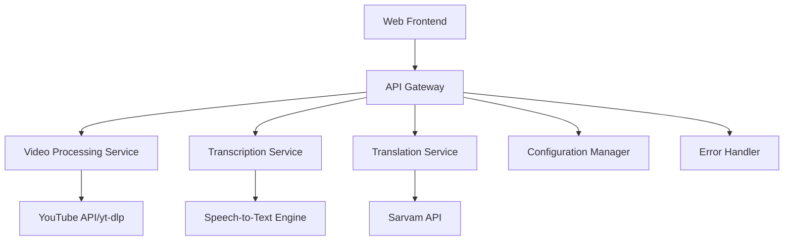

# VideoSpeak System Design Document

## Overview

VideoSpeak is a web-based application that processes YouTube videos to provide multilingual transcription and translation services. The system integrates YouTube video processing, speech-to-text transcription, and the Sarvam API for translation into Indian languages. The architecture follows a modular approach with clear separation of concerns between video processing, transcription, translation, and user interface components.

## Architecture

The system follows a client-server architecture with the following high-level components:



### Core Services

1. **Frontend Application**: React-based web interface for user interactions
2. **API Gateway**: Express.js server handling all API requests and routing
3. **Video Processing Service**: Handles YouTube URL validation and audio extraction
4. **Transcription Service**: Converts audio to text using speech recognition
5. **Translation Service**: Integrates with Sarvam API for multilingual translation
6. **Configuration Manager**: Manages API keys and application settings
7. **Error Handler**: Centralized error handling and user feedback

## Components and Interfaces

### Frontend Components

#### VideoInputComponent
- **Purpose**: Handles YouTube URL input and validation
- **Props**: `onUrlSubmit: (url: string) => void`
- **State**: `url: string, isValid: boolean, isLoading: boolean`
- **Methods**: 
  - `validateYouTubeUrl(url: string): boolean`
  - `handleSubmit(): void`

#### LanguageSelector
- **Purpose**: Displays available Indian languages for translation
- **Props**: `onLanguageSelect: (langCode: string) => void, availableLanguages: Language[]`
- **State**: `selectedLanguage: string`
- **Methods**: `handleLanguageChange(langCode: string): void`

#### ResultsDisplay
- **Purpose**: Shows transcription and translation results
- **Props**: `originalText: string, translatedText: string, sourceLanguage: string, targetLanguage: string`
- **Methods**: 
  - `copyToClipboard(text: string): void`
  - `downloadAsText(): void`

#### ProgressIndicator
- **Purpose**: Shows processing status and progress
- **Props**: `stage: ProcessingStage, progress: number, message: string`
- **State**: `isVisible: boolean`

### Backend Services

#### VideoProcessingService
```typescript
interface VideoProcessingService {
  validateYouTubeUrl(url: string): Promise<boolean>;
  extractVideoId(url: string): string;
  extractAudio(videoId: string): Promise<AudioBuffer>;
  getVideoMetadata(videoId: string): Promise<VideoMetadata>;
}
```

#### TranscriptionService
```typescript
interface TranscriptionService {
  transcribeAudio(audioBuffer: AudioBuffer): Promise<TranscriptionResult>;
  detectLanguage(text: string): Promise<string>;
  splitLongAudio(audioBuffer: AudioBuffer): AudioBuffer[];
}
```

#### TranslationService
```typescript
interface TranslationService {
  translateText(text: string, targetLang: string, sourceLang?: string): Promise<TranslationResult>;
  getSupportedLanguages(): Language[];
  validateApiKey(): Promise<boolean>;
}
```

## Data Models

### Core Data Types

```typescript
interface VideoMetadata {
  id: string;
  title: string;
  duration: number;
  language?: string;
  hasAudio: boolean;
  isShortVideo: boolean; // Videos under 5 minutes
  audioQuality: AudioQuality;
}

enum AudioQuality {
  LOW = 'low',
  MEDIUM = 'medium',
  HIGH = 'high'
}

interface TranscriptionResult {
  text: string;
  confidence: number;
  detectedLanguage: string;
  segments: TranscriptionSegment[];
  overallAccuracy: number;
  qualityScore: number;
}

interface TranscriptionSegment {
  text: string;
  startTime: number;
  endTime: number;
  confidence: number;
}

interface TranslationResult {
  translatedText: string;
  sourceLanguageCode: string;
  targetLanguageCode: string;
  requestId: string;
  translationAccuracy: number;
  confidenceScore: number;
  qualityMetrics: TranslationQualityMetrics;
}

interface TranslationQualityMetrics {
  fluency: number;
  adequacy: number;
  semanticSimilarity: number;
  grammarScore: number;
}

interface Language {
  code: string;
  name: string;
  nativeName: string;
  isSupported: boolean;
}

interface ProcessingJob {
  id: string;
  videoUrl: string;
  status: JobStatus;
  progress: number;
  currentStage: ProcessingStage;
  results?: ProcessingResults;
  error?: string;
  createdAt: Date;
  updatedAt: Date;
}

enum JobStatus {
  PENDING = 'pending',
  PROCESSING = 'processing',
  COMPLETED = 'completed',
  FAILED = 'failed'
}

enum ProcessingStage {
  VALIDATING_URL = 'validating_url',
  EXTRACTING_AUDIO = 'extracting_audio',
  TRANSCRIBING = 'transcribing',
  TRANSLATING = 'translating',
  COMPLETED = 'completed'
}

interface ProcessingResults {
  originalText: string;
  translatedText: string;
  sourceLanguage: string;
  targetLanguage: string;
  videoMetadata: VideoMetadata;
}
```

### API Request/Response Models

```typescript
interface ProcessVideoRequest {
  youtubeUrl: string;
  targetLanguage: string;
  sourceLanguage?: string;
}

interface ProcessVideoResponse {
  jobId: string;
  status: JobStatus;
  message: string;
}

interface JobStatusResponse {
  jobId: string;
  status: JobStatus;
  progress: number;
  currentStage: ProcessingStage;
  results?: ProcessingResults;
  error?: string;
}
```

## Error Handling

### Error Categories

1. **Validation Errors**: Invalid YouTube URLs, unsupported languages
2. **Processing Errors**: Video extraction failures, transcription errors
3. **API Errors**: Sarvam API failures, rate limiting, authentication issues
4. **System Errors**: Network connectivity, server errors, timeouts

### Error Response Format

```typescript
interface ErrorResponse {
  error: {
    code: string;
    message: string;
    details?: any;
    retryable: boolean;
  };
  timestamp: string;
  requestId: string;
}
```

### Error Handling Strategy

- **Client-side**: Form validation, network error handling, user-friendly messages
- **Server-side**: Input sanitization, API error mapping, retry logic
- **Monitoring**: Error logging, performance metrics, API usage tracking

## Testing Strategy

### Unit Testing
- **Frontend**: Component testing with Jest and React Testing Library
- **Backend**: Service layer testing with Jest and supertest
- **API Integration**: Mock Sarvam API responses for consistent testing

### Integration Testing
- **End-to-end**: Cypress tests covering complete user workflows
- **API Testing**: Postman/Newman for API endpoint validation
- **Error Scenarios**: Testing various failure modes and recovery

### Test Data Management
- **Mock YouTube URLs**: Test videos with known transcription content
- **Language Samples**: Test translations for accuracy verification
- **Error Simulation**: Mock API failures and network issues

### Performance Testing
- **Load Testing**: Multiple concurrent video processing requests
- **Audio Processing**: Large video files and long duration content
- **API Rate Limits**: Sarvam API usage patterns and throttling

## Security Considerations

### API Key Management
- Environment variables for sensitive configuration
- API key rotation and validation
- Rate limiting and usage monitoring

### Input Validation
- YouTube URL sanitization and validation
- Text input length limits and content filtering
- File upload restrictions and virus scanning

### Data Privacy
- No persistent storage of video content
- Temporary file cleanup after processing
- User data anonymization in logs

## Deployment Architecture

### Development Environment
- Local development with Docker containers
- Mock services for external API dependencies
- Hot reloading for rapid development

### Production Environment
- Containerized deployment with Docker
- Load balancing for high availability
- CDN for static asset delivery
- Monitoring and alerting systems

### Configuration Management
- Environment-specific configuration files
- Secret management for API keys
- Feature flags for gradual rollouts